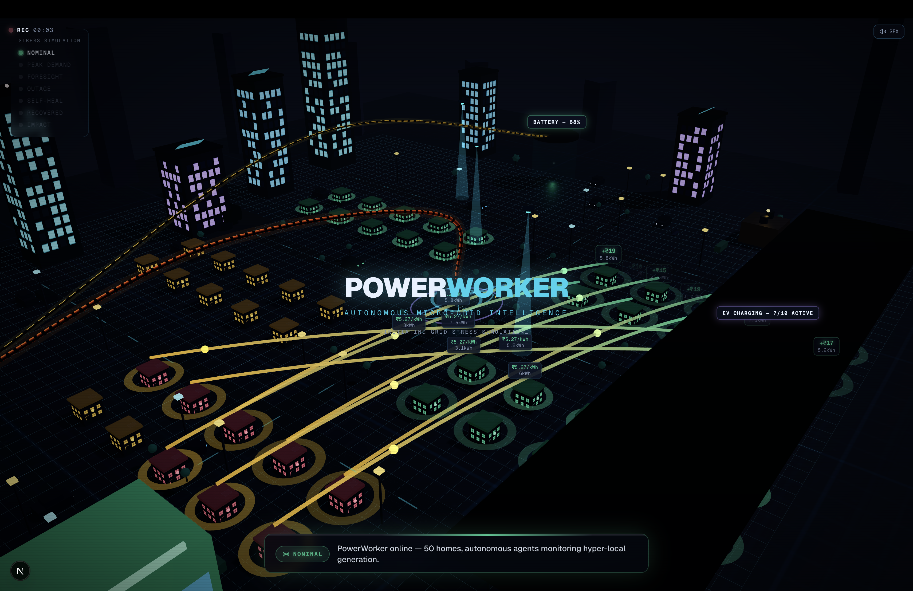
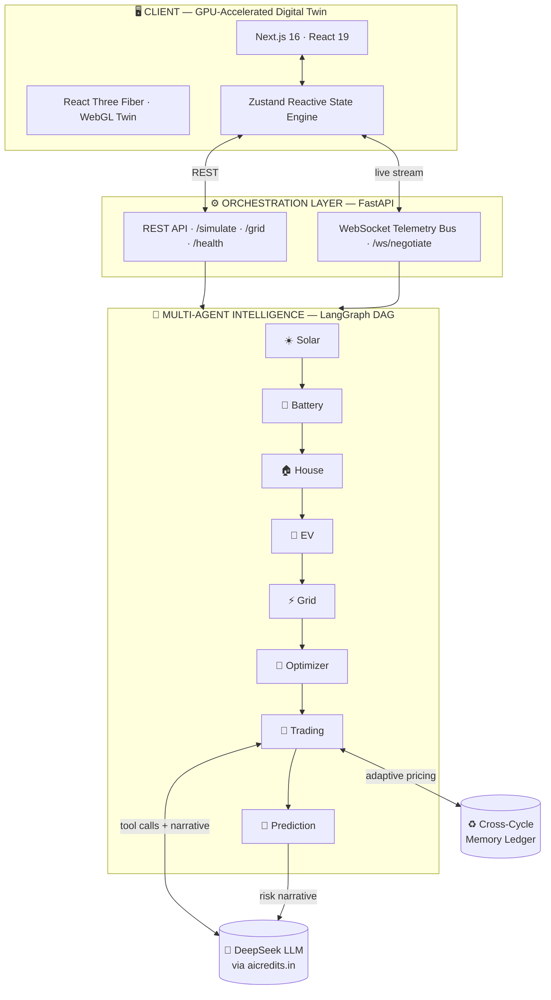

<div align="center">

# ⚡ PowerWorker

### Autonomous Decentralized Micro-Grid Intelligence

**A network of autonomous AI agents that monitor hyper-local power generation, predict grid failures before they happen, and autonomously trade energy peer-to-peer — keeping a community powered, cheaper, and greener even when the main grid goes dark.**




</div>

---

## 🌍 What is PowerWorker?

Imagine a neighborhood of 50 homes. Some have rooftop solar and make more power than they need. Others don't and pull expensive electricity from the grid — especially at peak hours, exactly when the grid is most likely to fail.

Today that energy imbalance is wasted, and outages hit with no warning.

**PowerWorker fixes this with a team of AI agents that run the neighborhood's power by themselves.** Every few seconds they:

1. 🔍 **Monitor** every home's generation vs. demand in real time.
2. 🔮 **Predict** grid-failure risk *before* it happens — with a clear plan to survive it.
3. 🤝 **Trade** surplus solar directly between neighbors at a fair, dynamic price — no middleman, no human in the loop.

When the grid *does* go down, the community **islands and self-heals**: batteries and rooftop solar keep the lights on while power reroutes peer-to-peer around the dead line.

You watch it all happen live in a **cinematic 3D digital twin**.

> **Built for the theme:** *Decentralised Energy Systems & Micro-Grids — create agent networks that monitor hyper-local power generation, predict grid failures, and autonomously execute peer-to-peer energy trading during peak demand.*

---

## 🎯 The Problem

- ☀️ Rooftop solar is booming, but a home's surplus is **wasted** while its neighbor overpays the grid.
- ⚡ Peak demand (heatwaves, evenings) is when prices spike **and** outages strike.
- 🔌 Consumers get **zero warning** before a failure and have **no way to coordinate** during one.
- 🏚️ The grid is centralized, reactive, and dumb.

## 🧠 The Solution — Three Autonomous Pillars

| Pillar | What the agents do |
|---|---|
| **🔍 Monitor hyper-local generation** | A per-household net-position engine computes surplus/deficit for all 50 homes every cycle. |
| **🔮 Predict grid failures** | A prediction agent scores failure risk (0–100) from supply margin, grid dependency, battery reserve, peak load & carbon intensity — then the LLM explains it and prescribes mitigations. |
| **🤝 Autonomous P2P trading** | A market-clearing engine matches surplus homes to deficit neighbors, prices dynamically by scarcity, **remembers last cycle to adapt its pricing**, and executes trades autonomously. |

---

## ✨ Key Features

- 🌆 **Live 3D Digital Twin** — a fully textured neighborhood with driving cars, drones, wind turbines, and glowing energy beams flying seller → buyer between homes.
- 🎬 **One-Click Stress Simulation** — a self-directing cinematic: *Normal → Peak Demand → Predicted Failure → Blackout → Self-Heal → Recovery → Impact*, with auto-camera, phase banners, and synthesized sound design.
- 🔮 **Grid-Failure Prediction** — real-time 0–100 resilience score with an AI-written narrative + recommended actions.
- 🤝 **P2P Energy Market** — a live ledger of every autonomous trade, dynamic scarcity pricing, and a **"watch the agents negotiate"** view where buyer & seller agents haggle to a deal.
- 🛰️ **Agent Command Center** — a real-time feed of every agent's reasoning, streamed live over WebSockets.
- 🖱️ **Click-to-Inspect** — click any home, the solar farm, battery, EV hub, or the agent core to inspect its live telemetry.
- 💬 **AI Energy Advisor** — a conversational agent (DeepSeek) that answers questions about savings, risk, and any home.
- 📊 **Impact Dashboard** — ₹ saved, CO₂ avoided, grid imports avoided, and a headline Grid Resilience Score, with a "With vs Without PowerWorker" comparison.

---

## 🏗️ Technical Architecture

PowerWorker is a **three-tier, event-driven system**: a GPU-accelerated WebGL client, a FastAPI orchestration layer, and a LangGraph multi-agent intelligence core backed by a live LLM.



### The Multi-Agent Pipeline

Every simulation cycle executes a **deterministic LangGraph execution graph** — eight specialized agents, each enriching a shared community state before passing it on:

```
☀️ Solar ─▶ 🔋 Battery ─▶ 🏠 House ─▶ 🚗 EV ─▶ ⚡ Grid ─▶ 🧮 Optimizer ─▶ 🤝 Trading ─▶ 🔮 Prediction
   │            │            │           │         │            │              │               │
 forecast    dispatch     per-home    flexible   tariff &     supply/       market-        failure-risk
 & surplus   & reserve    net pos.    load /     peak &       demand        clearing +     scoring +
 detection   management   demand      V2G        carbon       balancing     P2P matching   mitigation
```

### 🔬 Robust Agentic workflow

 **live LLM agents reason, negotiate, and adapt.** Run the **Stress Simulation** and the WebSocket telemetry bus streams the agents' *actual* decisions in real time — for example:

```log
[Grid Agent]       Carbon intensity 512 gCO₂/kWh is high — prefer battery/solar over grid import.
[Optimizer]        Resolved supply-demand mismatch: 18.4 kWh shortfall covered by battery discharge.
[Trading Agent]    Autonomously matched 12 P2P trade(s) totalling 66.1 kWh during a peak-pricing
                   window — community saved ₹204 vs. grid import.
[Trading Agent · memory]  Recall: sellers had surplus last cycle (fill 91%) — lowered the clearing
                   price 6% to ₹3.54/kWh to move more energy.
[Prediction Agent] Grid-failure risk 78/100 (CRITICAL) within 6h — pre-charge battery, stage P2P
                   contracts, shed non-critical EV load.
```

That `Trading Agent · memory` line is the key: the market-clearing engine carries **cross-cycle reinforcement memory** — it remembers how well supply met demand last cycle and **autonomously adjusts its pricing strategy**. This is genuine agentic behavior, not a static formula.

### 🛠️ Full Tech Stack

| Layer | Technology |
|---|---|
| **3D / Rendering** | Three.js · React Three Fiber · @react-three/drei · WebGL · procedural GPU textures |
| **Frontend** | Next.js 16 (App Router) · React 19 · TypeScript 5 · Zustand · Framer Motion · Recharts · Tailwind v4 |
| **Backend** | FastAPI · Python · Uvicorn (ASGI) · WebSockets |
| **Agent Orchestration** | LangGraph · LangChain-Core — deterministic multi-agent state graph |
| **AI / Inference** | DeepSeek LLM via the aicredits.in OpenAI-compatible gateway — tool-calling, structured JSON, streaming narratives |
| **Real-time** | Bidirectional WebSocket telemetry bus streaming live agent reasoning |
| **State & Memory** | In-memory trade & risk ledger · cross-cycle adaptive market memory |

---

## 📊 Impact

PowerWorker quantifies its value every cycle:

- 💰 **₹ Saved** — peer-to-peer vs. grid tariff
- 🌱 **CO₂ Avoided** — by maximizing local renewable use
- 🔌 **Grid Imports Avoided** — kWh kept off the grid at peak
- 🛡️ **Grid Resilience Score** — a single 0–100 headline metric
- 🏠 **Homes Protected During Outage** — the community rides through blackouts in island mode

---

## 🚀 Getting Started

**One command** boots the backend, the frontend, health-checks the AI, and tears everything down cleanly on `Ctrl+C`:

```bash
cd PowerWorker
./start-project
```

Then open **http://localhost:3000** and hit **▶ Run Stress Simulation**.

> **AI configuration:** create a `.env.local` in the project root with your gateway key (never committed):
> ```env
> AI_CREDITS_API_KEY=sk-...
> AI_CREDITS_MODEL=deepseek-chat
> AI_CREDITS_BASE_URL=https://api.aicredits.in/v1
> ```
> Without a key, PowerWorker runs in a deterministic mock mode so the demo never breaks.

**Manual start (optional):**
```bash
# Backend
cd backend && python3 -m venv .venv && . .venv/bin/activate
pip install -r requirements.txt && uvicorn main:app --port 8000

# Frontend
cd frontend && npm install && npm run dev
```

---

## 🧩 Project Structure

```
PowerWorker/
├── backend/                 # FastAPI + LangGraph multi-agent intelligence
│   ├── agents/              # 8-agent pipeline, state graph, market memory
│   ├── llms/                # DeepSeek client (tool-calling, streaming)
│   ├── routers/             # REST + WebSocket endpoints
│   └── main.py              # ASGI entrypoint
├── frontend/                # Next.js 16 + React Three Fiber digital twin
│   └── src/
│       ├── app/             # App shell & command center
│       ├── components/      # 3D twin, panels, cinematic overlays
│       └── store/           # Zustand state engine
└── start-project           # One-command launcher
```

---

<div align="center">

## 👥 Built by **Team Paradox**

### for the **Bit Build Hackathon** 🏆

*Powering communities with autonomous intelligence.*

</div>
